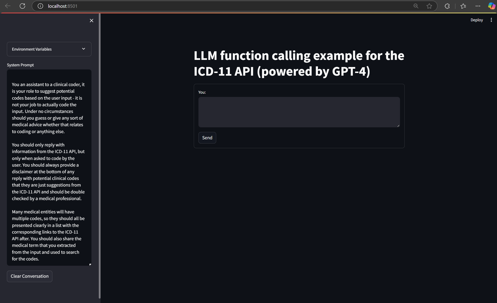
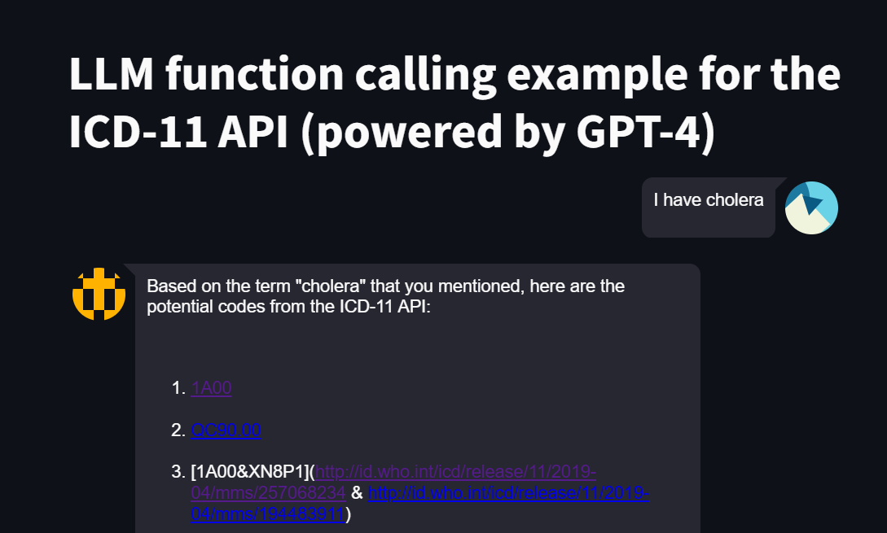

# ClinicalCodingWithAOAI
A simple Streamlit application, powered by AOAI, that creates a clinical coding assistant. This is a pre-alpha repository.

### Setup

* Install the dependencies documented in the requirements file,
* Create an account for the ICD-11 API here: https://icd.who.int/icdapi,
* Create an Azure OpenAI service with a GPT-4 model deployed,
* Populate an `.env` file with the following information taken from the relevant places:
    * AZURE_OPENAI_ENDPOINT,
    * AZURE_OPENAI_KEY,
    * AZURE_OPENAI_DEPLOYMENT_NAME,
    * ICD_KEY,
    * ICD_CLIENT

### Usage

In a terminal, once in the main directory, run the command `streamlit run .\app.py` to run the application locally.

### Next steps

* Prompt engineering to ensure the bot can handle the complex relationships between specific medical ontologies.
* UI design - specifically how the codes are returned.
* Gracefully handle the ICD API access token(s).

### References
* https://github.com/IHTSDO/openai-demo

### Gallery

